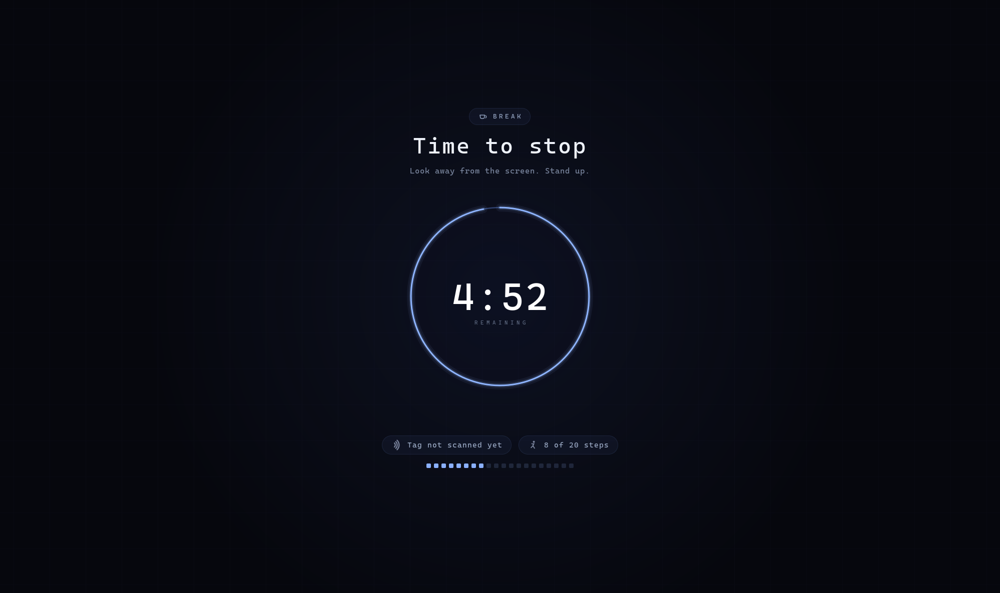

# tea

You mean to take breaks. You don't.

tea waits in the background while you work, and every so often it takes the
screen for a few minutes. There's a countdown. When it runs out you get your
desk back.

It tries not to be daft about it:

- If you've already been away from the keyboard, that counted as your break —
  it won't ambush you the second you sit back down.
- If you're in a call or watching something, it waits until you're done rather
  than dropping a black screen over your face.
- If you genuinely can't stop right now, there's a button for that. Twice an
  hour, so it stays a reprieve and not a habit.

By default it can't physically hold you there — you can still switch away if
you're determined. The aim is for stopping to be easier than dodging. If that
is too easy, `hold.mode = "insist"` makes the page put itself back in front
every time you leave it.

Built for Ubuntu GNOME on Wayland.

    ./dist/install.sh     # build it, install it, start it running
    tea status            # see what it is up to
    tea set-work 30m      # change your mind

## Config

Created on first run at `$XDG_CONFIG_HOME/tea/config.toml`, else
`~/.config/tea/config.toml`. `--config <path>` points elsewhere,
`--write-config` writes the starter file and exits, and every setting has a
matching flag that overrides the file (`tea --help`).

    work = "25m"
    break = "5m"
    warn_before = "30s"

    [idle]
    credit = "5m"
    pause = "1m"

    [postpone]
    duration = "1m"
    budget = 2
    window = "1h"

    [hold]
    mode = "soft"
    recheck = "400ms"

Durations are `"90s"`, `"25m"`, `"1h"`; a bare number means minutes. Unknown
keys are a hard error — a silently ignored typo in a config you edit twice a
year is worse than a crash on startup.

## Holding the screen

`hold.mode` decides what the break page does when you switch away from it.

    soft      it covers the screen and leaves it at that (default)
    insist    it puts itself back in front, for the whole break

Wayland is the reason there is a choice at all. There is no keyboard grab and
Mutter implements no layer-shell, so no client can own the screen; `insist` is
attrition instead. Every `recheck` it asks whether you are working *beside* the
break: input arriving while none of the pages holds the focus. Input is the
tell, not focus alone — GNOME refuses focus to windows you never touched, so a
page can be covering every screen, doing its job, without being "active", and
fighting over that would be a strobe. Keep your hands off the keyboard and
nothing on screen so much as blinks.

When you *are* still typing or mousing, the page asks for the focus back. GNOME
turns that request down when it comes from a window you didn't just touch, so
after a few refusals the page is *built again* — a brand new window, carrying
the time that's actually left, put up before the old one is destroyed behind
it. A window that has just appeared is one the compositor will raise.

Built again, not hidden and re-shown. Re-showing is the obvious way to look new
and it works for about a second: the surface comes back mapped and the right
size, but its frame clock never resumes, so nothing is drawn into it ever again.
That gives you a page that is unmistakably there and completely black — the
worst of both, since it covers the screen without telling you how long is left.

Every screen comes back, not just the one you left from. Only one window can
hold the focus, but any of the others can be *buried* — raise something on your
second monitor and a page that only guarded the first would leave you a desk to
work at. So the question asked each `recheck` is about all the screens at once:
if none of the pages is the active window, all of them are put back. Clicking
the page on the second screen is not an escape, and does not make the first one
snatch the focus away.

Screens that come and go mid-break are followed, in both modes: dock the laptop
and the new monitors get pages carrying the time that's left, undock it and the
survivors keep theirs.

None of it stops someone who keeps switching away, and nothing here should.
`insist` makes leaving a thing you have to keep choosing.

## Status

    $ tea status

      tea — working

      work      ██████████████░░░░░░░░░░   60%
                15m of 25m — next break in 10m

      postpone  1 of 2 left — resets in 40m
      now       idle 4s · nothing is holding a break
      service   running · saved 2s ago
      config    ~/.config/tea/config.toml

Read from the state file the service already writes, so it is accurate to
within one save interval. It shows the config file's values — if you edit the
config while the service is running, restart it before trusting the numbers.

## Layout

    crates/core   pure state machine + the `Blocker` trait — no clock, no I/O
    crates/cli    host: config, clock, D-Bus session, GTK overlay, terminal
    dist/         systemd user unit + install script

GTK owns the main loop; the scheduler rides a 1s `glib` timeout on it. No
threads and no locking anywhere in the program.

The scheduling rules live entirely in `core` and are exercised without waiting
five minutes for anything. Everything platform-shaped stays outside it.

## Rules that matter more than the timer

- **Idle credit** — away 5+ minutes? That was your break. A tool that ambushes
  you the moment you sit back down gets uninstalled in two days. Idle comes from
  `org.gnome.Mutter.IdleMonitor`, and an absence is credited *once*, not once
  per second.
- **Idle pause** — away 1–5 minutes banks no work time.
- **Break debt survives a restart** — state in `$XDG_STATE_HOME/tea/state.toml`.
  Downtime while the machine was *up* counts as work, so restarting the service
  is not a dodge; downtime across a *reboot* counts as rest. Reboot is detected
  by boottime going backwards, which is the one thing a reboot cannot fake.
- **Suspend counts** — timing runs on CLOCK_BOOTTIME (`/proc/uptime`), not
  `Instant`, so a closed lid is rest rather than time that never happened.
- **Calls count as work** — while an app holds the session awake (a call, a
  video, a presentation) you are looking at a screen, so neither idle rule
  applies. Without this, sitting still through an hour of meetings reads as an
  hour of rest and hands back breaks you never took.
- **A held-up break is never forced through** — covering the screen mid-call is
  the one thing this must not do. After `calls.warn_after` it says who is
  holding it (`tea --probe` names them too) and leaves it at that.
- **Inhibitors** — a break owed during a screen share is deferred, not lost.
  Read from `org.gnome.SessionManager.IsInhibited(8)`, the same flag video
  players and presentation mode set.
- **Degrades, never fails** — no session bus (SSH, gnome-shell restart) costs
  accuracy, not availability: it falls back to suspend-gap detection and says so
  once.
- **Postpone is budgeted** — 2 per hour, only once a break is imminent.
  Unlimited snooze is the same as no tool.

## Roadmap

- [x] **P0** state machine + CLI host
- [x] **P1** TOML config, GTK4 overlay, `systemd --user` unit
- [x] **P2a** real idle via `org.gnome.Mutter.IdleMonitor` + inhibitor detection
- [x] **P2b** break debt persisted to `$XDG_STATE_HOME`
- [ ] **P3** *only if you keep dodging it* — GNOME Shell extension for a real
      input grab

`P1` puts the overlay behind a `trait Blocker`, so `P3` (or a layer-shell
backend for Sway/KDE) is an addition rather than a rewrite.

## Install

    ./dist/install.sh    # builds, installs to /usr/local/bin, enables the user service

Needs `libgtk-4-dev` to build.

It runs as a **user** service, not a system one — `sudo systemctl` looks at the
wrong manager and reports the unit as missing:

    systemctl --user status tea
    journalctl --user -u tea -f
    systemctl --user restart tea     # required after reinstalling the binary

## Try it

    tea run                    # show the break page, for as long as a real break
    tea run 5s                 # ...or for however long you say
    tea run-warning            # show the warning toast
    tea reload                 # pick up edited settings
    tea status                 # what the running service is doing
    tea config                 # every setting, nicely laid out
    tea set-work 30m           # change a setting, comments preserved
    tea set-break 5m
    tea set-warn 30s
    tea --probe                # print live idle/inhibitor readings and exit
    tea --headless             # terminal only; the only thing that works over SSH
    tea --work 5s --break 3s --postpone-budget 0

Only one instance runs at a time — a second `tea` hands off to the first
rather than starting a competing timer, and the first ignores the handoff
rather than starting a second timer inside itself.

Breaks are silent by default — point `tea set-sound <file>` at a sound you
actually like, or set `[sound] mode = "voice"` to have it spoken. The overlay
fades in rather than appearing all at once. The 30-second
warning only opens a window when there is a postpone to click; otherwise it is a
desktop notification, because a window you can do nothing about is just noise.
